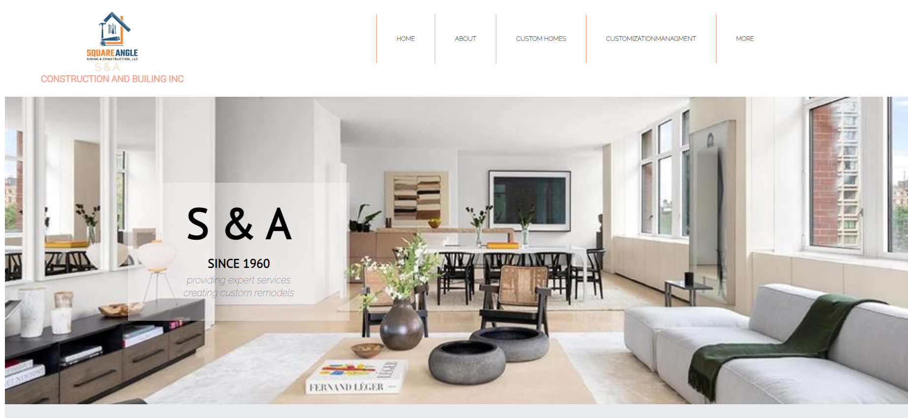

 # CREATION OF A LANDING PAGE 

 ## Welcome!

 ##let's get started.

 Thank you for checking this work, once again.

 ## About This Work:
   This is a one page mini construction websites. This template was created for the practsie of HTML AND CSS. And also to help master flex-box in particular, with all other basic HTML practices.

## pictures of this Work
 ##An Example##

 ##process##
      THIS FILE IS FOR THE PRACTISE OF HTML(DEEPER)
 -PRACTISE FOR THE BUILDING OF MODERN SEMANTIC WEBSITE.
 -STRUCTURES OF DIFFERENT , AND PROPER DISPLAY OF MARKUP'S IN A CONTAINER.
 -PRACTISED THE USE OF LINE-BREAKS FOR FASTER OUTCOME OF HTML CSS SPACING.
 -CHECKED OUT FOR LINKING OF FILES PROPERLY TO ENSURE PROPER DISPLAY OF WEB PAGES.

    THIS FILE IS FOR THE PRACTISE OF CSS
 -PRACTISED USING MAINLY FLEX-BOX TO YIELD OUT A BEAUTIFUL LAYOUT OF DIFFERENT SECTIONS.
 -USED FLEXBOX AGAIN TO CONTROL THE DISPLAY PATTERN.
 -USED THE FLOAT PROPERTY(QUITE POWERFUL) TO WRAP THE TEXTS AROUND IMAGES PROPERLY IN THE BLOG SECTIONS.
 -GAVE EACH LINKS BEAUTIFUL HOVER EFFECTS.
 -SINCE THIS WORK IS DONE FOR THE PRACTISE OF FLEX-BOX CHECK IT OUT:
 -IT'S ALSO QUITE RESPONSIVE FOR MOBILE USER'S.

 ##Larger screen sizes##

 ##smaller screen sizes##
 

##worked on an background section##
-CSS BACKGROUND: Worked with beautiful background pictures and practised beautiful layout of background pictures.

  ## Built with         
      -HTML(Hypertext Mark-up Language)
      -CSS(Cascading Styles Sheet)

  ## My Challanges and lessons
   Learnt how to re-size pictures to fit their appropraite background.I also learnt a lot from float and clearfix hacking to it was kind of tiring.
   
 
 
 

   ## Installations
   -For those Farmiliar with Git-hub you can clone the repo and pull to your local workplace to view.
   -For those who want to view you can check this work from here [https://app.netlify.com/sites/romantic-lamarr-868c3d], to view Thank you once again.
    -For those who want to view the second work, you can check this work from here [https://app.netlify.com/sites/infallible-beaver-15a4e4], to view Thank you once again.

   ## Best syntax Used

    ``CSS
   (float), (flex-box), and (power of proper font usage).
 The float property was quite intersting.dispaying pictures and giving them nice layout's; Mixing with flex-box for multiple and easy layout.
   ``

   ## Resources that helped ##
   -For the Colors[https://htmlcolorcodes.com/color-names/]

   -For the icons[https://fontawesome.com/v5.15/icons/] and svg's in the folder.

   -For the images[https://unsplash.com/]

   -For the Fonts[https://fonts.google.com/]

 ## Licsense 
   This work is under [MIT] liscence. It's highly free and opensource to anyone.
